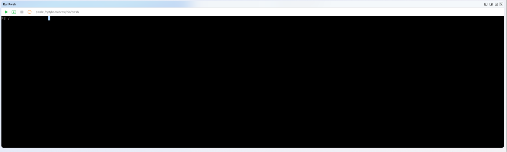

# RunPwsh — Nextpad++ macOS Plugin

**Version:** 4.0.1 — see [CHANGELOG.md](CHANGELOG.md) for the version history.

A PowerShell-ISE-like panel for Nextpad++ (macOS): run the current script or
just the current selection against a **single persistent `pwsh` session**
(variables and functions survive across runs, exactly like the real ISE) in
a **real embedded terminal** — type directly into it, arrow-key history and
tab-completion work, masked credential prompts stay hidden, exactly like a
real terminal window — interrupt a running command without losing the
session, restart it when you actually want a clean slate, and — if PowerShell
isn't installed yet — install it with one click via Homebrew. The behavior
follows the PowerShell terminal of Visual Studio Code's PowerShell extension. Built on the
same native Nextpad++ plugin
API for macOS (`NppPluginInterfaceMac.h`, see `vendor/README.md`) as the
[Finder plugin](https://github.com/ioso71/Finder.macos), and follows several of
its established conventions directly (panel docking, SF-Symbol panel
buttons, German/English localization).



## Dependencies

The plugin itself (Cocoa/AppKit, Foundation) has no third-party
dependencies. Since v2.0.0 it also embeds a small Swift bridge
(`swift/RunPwshTerminalBridge/`, its own SwiftPM package) around
[SwiftTerm](https://github.com/migueldeicaza/SwiftTerm) for the terminal
widget itself — see "Building" below for what that means for the build.
Beyond that, it shells out to `pwsh`, `/usr/bin/open`, and (only when the
user explicitly clicks "Install via Homebrew") `brew` — none of these are
build-time dependencies, just runtime executables the plugin looks for and,
in the `pwsh` case, offers to install.

## Requirements

macOS 12.0 or later (universal binary, arm64 + x86_64). Building needs Xcode
or the Command Line Tools (Objective-C++ and the Swift toolchain) and CMake.
It cannot be compiled on Linux. At runtime you need PowerShell (`pwsh`); the
plugin offers to install it via Homebrew if it is missing.

## Structure

```
RunPwsh.macos/
├── CMakeLists.txt              Build configuration (produces RunPwsh.dylib;
│                                also shells out to `swift build` for
│                                swift/RunPwshTerminalBridge/ and links it in)
├── resources/
│   ├── toolbar.png              Main toolbar/menu-band icon (light mode)
│   └── toolbar_dark.png         Main toolbar/menu-band icon (dark mode)
├── docs/
│   └── panel-bottom.png         Screenshot used in this README
├── tests/
│   └── RunPwshSessionTests.mm   Unit tests for the session state machine
├── THIRD-PARTY-NOTICES.md       License of the bundled SwiftTerm library
├── vendor/
│   ├── NppPluginInterfaceMac.h  Unmodified copy of the plugin ABI from the host repo
│   └── README.md                Provenance/sync note for the vendored file
├── swift/
│   └── RunPwshTerminalBridge/   SwiftPM package: @objc wrapper around
│                                SwiftTerm's LocalProcessTerminalView (the
│                                actual terminal widget embedded in the panel)
└── src/
    ├── RunPwshPlugin.mm         Mandatory exports (setInfo/getName/getFuncsArray/
    │                            beNotified/messageProc), panel registration,
    │                            menu commands, auto-save-before-run, selection
    │                            text retrieval via Scintilla SCI_GETSELTEXT,
    │                            lazy persistent-session startup
    ├── RunPwshPanelView.h/.mm   Toolbar (Run Script / Run Selection / Stop /
    │                            Restart Session),
    │                            install-via-Homebrew banner, embedded
    │                            terminal (RunPwshTerminalBridge)
    ├── RunPwshPreferences.h/.mm Remembers whether the panel was open (JSON file)
    ├── RunPwshSession.h/.mm     Session state machine (Idle → Starting → Ready
    │                            ⇄ Running → Ended); "ready" = pwsh printed a prompt
    ├── RunPwshEngine.h/.mm      pwsh/brew discovery,
    │                            Homebrew install (non-interactive NSTask)
    └── RunPwshLocalization.h/.mm  DE/EN localization (same pattern as the
                                    Finder plugin's FinderLocalization)
```

## Building (on a Mac)

Prerequisite: Nextpad++ has already been built from
`nextpad-plus-plus-macos` (or installed) — this plugin builds
independently of that, but has to be loaded by a running Nextpad++ instance
at runtime.

Also requires the **Swift toolchain** (ships with Xcode / the Command Line
Tools — `swift build` must be on PATH) and, the *first* time only, **network
access**: `cmake --build` shells out to `swift build` for the
`swift/RunPwshTerminalBridge/` SwiftPM package, which fetches
[SwiftTerm](https://github.com/migueldeicaza/SwiftTerm) as a dependency.

```sh
git clone https://github.com/ioso71/RunPwsh.macos.git
cd RunPwsh.macos
cmake -S . -B build
cmake --build build
cmake --build build --target install_plugin
```

Result: `build/RunPwsh.dylib` (universal binary, arm64 + x86_64) plus
`swift/RunPwshTerminalBridge/.build/universal/libRunPwshTerminalBridge.dylib`
(itself built as arm64+x86_64 and combined with `lipo` — see "Note on the
Swift bridge's build" below), copied by `install_plugin` to
`~/Library/Application Support/Nextpad++/plugins/RunPwsh/` (both files,
alongside `resources/`) — RunPwsh.dylib finds the Swift bridge dylib next to
itself via an `@loader_path` rpath. Restart Nextpad++ to load it.

**Universal Swift bridge:** `swift build` without `--arch` only builds the
host's architecture, so the CMake target builds the bridge for arm64 and
x86_64 separately and combines them with `lipo`. The SwiftTerm version is
pinned exactly in `Package.swift`; the bridge's `@objc` surface
(start/feed/typeText/interrupt/killSession/onProcessExited) is what
`RunPwshPanelView.mm` relies on.

## Using it

The embedded terminal hosts one **persistent** interactive
`pwsh -NoLogo -NoProfile -ExecutionPolicy Bypass` session. Since v4.0.0 it
**starts as soon as the panel is shown**, so the banner and the
`PS <path>>` prompt are there and you can type right away. `$variables` and
functions defined by one run are still there for the next.

How "ready" is detected: the session starts `pwsh` with a `prompt` override
that emits an OSC 7 sequence before every prompt. The terminal reports it to
the plugin, which then knows `pwsh` is at a prompt. Runs requested earlier
(while `pwsh` is still starting, or while another command is running) wait in
a single queue slot and are sent at the next prompt; there are no timers.

- **Run Script** (green play button): saves the current file (if the buffer
  is untitled, the host's Save dialog appears first), then dot-sources it
  (`. '<path>'`, after a `Set-Location` into its folder) so top-level
  variables/functions stay in the session.
- **Run Selection** (green rectangle button): types the selected text into
  the session. With no selection it runs the current line (like F8 in VS
  Code). Multi-line text is typed with a real Enter (`\r`) after each line.
- **Stop** (gray/red square): Ctrl+C — interrupts the running command and
  drops anything still queued. The session stays alive.
- **Restart Session** (circular arrow): ends the `pwsh` process (SIGTERM,
  then SIGKILL after a short grace period) and starts a fresh one.
- If `pwsh` exits (`exit`, crash), the terminal prints "Session ended" and
  **Restart Session** starts a new one.
- All commands are also in the editor's right-click menu under
  **Plugin Commands → RunPwsh**.
- **Open/closed state is remembered.** The panel is not opened on its own at
  first launch; open it with the toolbar button or **Plugins → RunPwsh →
  Toggle RunPwsh Panel**. From then on it comes back the way you left it
  (open stays open, closed stays closed, including closing it with the
  panel's X). No `pwsh` runs while the panel is closed. The state is kept in
  `runpwsh-plugin-prefs.json` in the plugin config folder.
- **Keyboard shortcuts:** the host ignores shortcuts proposed by plugins.
  Assign F5 / F8 (or any key) yourself under **Edit → Shortcut Mapper… →
  Plugins**.
- If no `pwsh` binary can be found, a banner appears with an **Install via
  Homebrew** button (runs `brew install --cask powershell`). If Homebrew is
  missing too, the banner points to <https://brew.sh>.
- **The console is a real, typeable terminal:** click into it and type
  directly — arrow-key history, tab completion and masked prompts
  (`Get-Credential`, `Read-Host -AsSecureString`, …) work as in any terminal,
  because the widget is SwiftTerm. The console always uses a fixed dark
  background with light text.

## The panel


The panel can be docked at the side or at the bottom of the window (as in the
screenshot). Use the dock buttons in the panel's title bar at the top right to
move it. Its own toolbar has four buttons, from left to right:

| Button | Action |
|---|---|
| Green play | **Run Script**: save and dot-source the current file |
| Green play in a rectangle | **Run Selection**: run the selection, or the current line |
| Gray square | **Stop**: Ctrl+C (greyed out while nothing is running) |
| Orange circular arrow | **Restart Session**: start a fresh `pwsh` |

Next to the buttons the panel shows the `pwsh` binary in use. The plugin's
main-toolbar icon (`resources/toolbar.png`, with a dark-mode variant) toggles
the panel.

## Running the unit tests

The session state machine has plain assert-style tests (no XCTest, no host
needed):

```sh
cmake -S . -B build
cmake --build build --target run_session_tests
```

Everything else (terminal, docking, focus, keyboard input) is verified by hand
in the running Nextpad++: open the panel, type, run a line and a selection,
Stop, Restart Session, hide and show the panel, and dock it at the side and at
the bottom.

## Known limitations

See [CHANGELOG.md](CHANGELOG.md). Notably: only one terminal session (no
terminal list like VS Code), and the panel is docked wherever the host puts it
(side or bottom, via the dock buttons in the panel's title bar).

## License

MIT — see [LICENSE](LICENSE). The bundled SwiftTerm library is also MIT
licensed, see [THIRD-PARTY-NOTICES.md](THIRD-PARTY-NOTICES.md).
